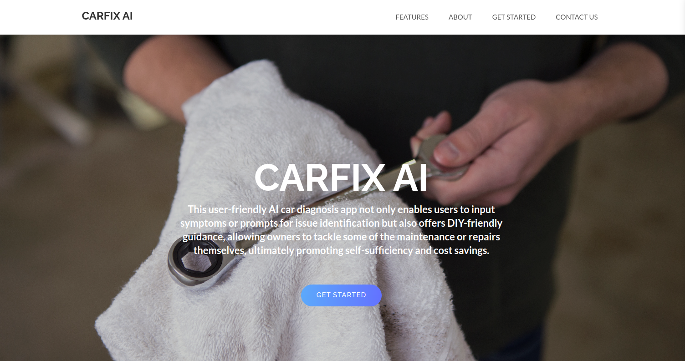

# CARFIX AI
Car DIagnostic App powered by AI

**Link to project:** https://carfixai.net/

## How It's Made:

**Tech used:** React, MUI, ChatGPT API

I built this website with DIY car enthusiasts in mind. When you're dealing with a car problem, you can input the symptoms, and the platform will not only identify potential causes but also provide customized research and video tutorials for fixing it. It's like a helpful companion guiding you through the troubleshooting process. The aim is to simplify the whole experience and save you a significant amount of time on research, making car repairs more accessible and straightforward.

## Optimizations

Needed optimizations: 
- Make app responsive for specific Iphones
- Create a better design for navigation component
- Fix youtube search results

## Lessons Learned:

- How to use ChatGPT Api
- Reinforced MUI knowledge
- Reinforced styled components knowledge

